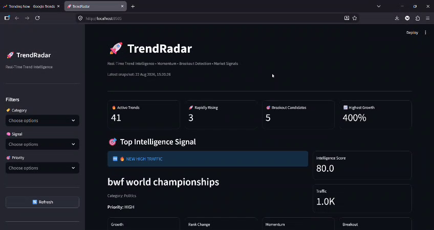
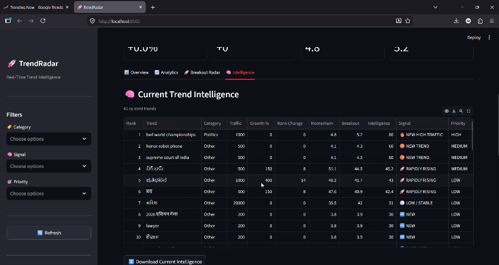
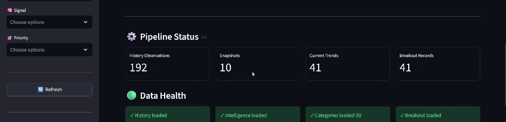

Absolutely. 🔥 **This is the corrected final `README.md`**, based on the TrendRadar structure and pipeline you showed me.

**Delete everything currently inside `README.md` and paste this entire block:**

```markdown
# 🚀 TrendRadar

### Real-Time Trend Detection, Momentum Analysis & Breakout Intelligence

TrendRadar is an end-to-end trend intelligence system that collects live trending topics, tracks their historical movement, calculates momentum, classifies trends, detects potential breakout candidates, and generates higher-level trend intelligence.

The system processes live trend data through multiple analytical stages and presents the results through an interactive Streamlit dashboard.

---

## 🎯 Project Objective

The goal of TrendRadar is to answer:

> **What is trending right now, how is it moving, and which trends deserve attention?**

Instead of evaluating a topic only by its current traffic, TrendRadar combines multiple signals including:

- Current traffic
- Historical appearance
- Rank movement
- Persistence
- Momentum
- Trend score
- Breakout score
- Category
- Intelligence signals

This provides a more comprehensive view of how trends are emerging, rising, remaining stable, or falling.

---

## 🔄 Pipeline

TrendRadar processes live trend data through the following pipeline:

```text
Live Trend Collection
        ↓
Trend History / Momentum
        ↓
Category Classification
        ↓
Feature Engineering
        ↓
Breakout Detection
        ↓
Trend Intelligence
        ↓
Interactive Dashboard
```

The complete pipeline can be executed using:

```bash
python pipeline.py
```

---

## ⚡ Core Components

### 1. Live Trend Collection

**File:**

```text
live_trends.py
```

Collects the latest available live trend observations.

The collected data includes information such as:

- Topic
- Traffic
- Publication time

Output:

```text
data/live_trends.csv
```

---

### 2. Trend History & Momentum

**File:**

```text
trend_history.py
```

Maintains historical trend snapshots and compares current observations with previous snapshots.

It calculates signals including:

- Traffic change
- Growth
- Rank change
- Appearance count
- Persistence score
- Traffic-level score
- Momentum score

Output:

```text
data/trend_history.csv
```

---

### 3. Category Engine

**File:**

```text
category_engine.py
```

Classifies detected trends into categories.

Current categories include:

- Sports
- Politics
- Business & Finance
- Automotive
- Education
- Regional
- News & Events
- Other

Output:

```text
data/categorized_trends.csv
```

---

### 4. Feature Engineering

**File:**

```text
trend_features.py
```

Builds trend-level features from the current and historical trend data.

Important signals include:

- Rank
- Traffic
- Growth
- Acceleration
- Persistence
- Trend score
- Trend status

Trend statuses include:

```text
🚀 BREAKOUT
🔥 HOT
📈 RISING
🟢 EMERGING
⚪ LOW
```

Output:

```text
data/trend_features.csv
```

---

### 5. Breakout Engine

**File:**

```text
breakout_engine.py
```

Analyzes current trends for characteristics associated with potential breakout behavior.

The breakout analysis combines signals such as:

- Rank change
- Persistence
- Momentum
- Traffic level

It produces:

- Breakout score
- Breakout probability
- Breakout status
- Breakout ranking

Output:

```text
data/breakout_signals.csv
```

---

### 6. Trend Intelligence Engine

**File:**

```text
trend_intelligence.py
```

Combines the outputs of the previous analytical stages into a higher-level intelligence layer.

It evaluates:

- Category
- Traffic
- Growth
- Rank movement
- Momentum
- Breakout score
- Intelligence score

It generates intelligence signals such as:

```text
🔥 NEW HIGH TRAFFIC
🟠 NEW TREND
🆕 NEW
📉 FALLING
⚪ LOW / STABLE
```

It also assigns priority levels:

```text
HIGH
MEDIUM
LOW
```

Output:

```text
data/trend_intelligence.csv
```

---

## 📊 Dashboard

TrendRadar includes an interactive dashboard for exploring the generated trend intelligence.

**Dashboard file:**

```text
dashboard.py
```

Run the dashboard using:

```bash
python -m streamlit run dashboard.py
```

The dashboard provides an interactive way to explore the processed trend data and intelligence instead of manually inspecting CSV files.

---

## 🧠 Trend Intelligence

TrendRadar does not rely on a single metric.

A topic having high traffic does not automatically mean that it is a breakout trend.

The system considers multiple dimensions:

```text
Traffic
   +
Persistence
   +
Momentum
   +
Rank Movement
   +
Trend Features
   +
Breakout Signals
   ↓
Trend Intelligence
```

This allows the system to evaluate trend behavior from multiple signals rather than simply sorting topics by traffic.

---

## 🔁 Live Data Behavior

TrendRadar is designed around repeated trend snapshots.

Each pipeline execution can collect a new live snapshot and update the historical trend data.

As more snapshots are collected, the system can build stronger historical signals for:

- Persistence
- Rank movement
- Momentum
- Trend history
- Breakout analysis

Therefore, the topics, scores, rankings, and intelligence signals are dynamic and can change when new live data is collected.

---

## 📁 Project Structure

```text
TrendRadar/
│
├── app.py
├── pipeline.py
├── dashboard.py
│
├── live_trends.py
├── trend_history.py
├── category_engine.py
├── trend_features.py
├── breakout_engine.py
├── trend_intelligence.py
│
├── trend_engine.py
├── trend_detector.py
├── trend_detector_v2.py
├── trend_collector_v2.py
├── topics.py
│
├── feature_engineering.py
├── feature_engineering_v2.py
├── build_regime.py
├── build_trend_score.py
├── fix_category_features.py
│
├── train_model_v2.py
├── train_breakout_model.py
├── ml_model.py
├── create_breakout_target.py
│
├── data/
│   ├── live_trends.csv
│   ├── trend_history.csv
│   ├── categorized_trends.csv
│   ├── trend_features.csv
│   ├── breakout_signals.csv
│   └── trend_intelligence.csv
│
├── tests/
│   ├── analyze_breakout_shift.py
│   ├── backtest.py
│   ├── baseline_comparison.py
│   ├── check_latest_missing.py
│   ├── check_missing_topic.py
│   ├── final_holdout.py
│   ├── model_comparison.py
│   ├── test_live_trends.py
│   ├── test_trends.py
│   ├── threshold_analysis.py
│   └── validate_trend_data.py
│
├── engines/
├── models/
├── docs/
├── screenshots/
├── archive/
│
├── requirements.txt
└── README.md
```

---

## 🛠️ Technologies

### Programming

- Python

### Data Processing

- Pandas
- NumPy

### Machine Learning & Analysis

- Scikit-learn
- Feature engineering
- Model evaluation
- Historical trend analysis

### Dashboard & Visualization

- Streamlit
- Plotly

### Development

- VS Code
- PowerShell
- Git
- GitHub

---

## 📦 Installation

Move into the project directory:

```bash
cd TrendRadar
```

Install the required dependencies:

```bash
pip install -r requirements.txt
```

---

## ▶️ Running TrendRadar

### Run the complete pipeline

```bash
python pipeline.py
```

The pipeline executes:

```text
Live Trends
→ Trend History / Momentum
→ Category Engine
→ Feature Engine
→ Breakout Engine
→ Trend Intelligence
```

After successful execution, the generated datasets are stored inside:

```text
data/
```

---

## 📈 Example Pipeline Output

A successful pipeline execution ends with:

```text
🎉 TREND RADAR PIPELINE COMPLETED!

All live trend data has been processed.
Trend intelligence has been generated.
You can now open the dashboard.
```

The exact topics, rankings, scores, and intelligence signals can change as new live trend snapshots are collected.

---

## 🧪 Testing & Validation

The project contains a dedicated `tests/` directory for testing, validation, and analytical experiments.

Examples include:

```text
test_live_trends.py
test_trends.py
validate_trend_data.py
backtest.py
baseline_comparison.py
model_comparison.py
threshold_analysis.py
final_holdout.py
analyze_breakout_shift.py
```

These scripts support activities such as:

- Data validation
- Trend testing
- Backtesting
- Model comparison
- Threshold analysis
- Holdout evaluation

---

## 📂 Data Organization

Active pipeline outputs are stored in:

```text
data/
```

Older or archived outputs can be kept separately in:

```text
archive/
```

This keeps current pipeline results separate from previous datasets and experiments.

---

## 🎯 Key Features

- ✅ Live trend collection
- ✅ Historical trend tracking
- ✅ Momentum analysis
- ✅ Rank movement analysis
- ✅ Persistence scoring
- ✅ Trend categorization
- ✅ Feature engineering
- ✅ Trend scoring
- ✅ Breakout detection
- ✅ Breakout probability
- ✅ Trend intelligence
- ✅ Priority classification
- ✅ Interactive Streamlit dashboard
- ✅ Testing and validation
- ✅ Organized project structure

---

## 🚀 Future Improvements

Potential future improvements include:

- Additional live trend sources
- More sophisticated semantic topic classification
- Improved multilingual classification
- Automatic dashboard refresh
- Historical trend visualization
- Advanced anomaly detection
- Improved breakout prediction
- Automated trend alerts
- Web deployment
- Cloud-based data storage
- Scheduled data collection

---

## 👨‍💻 Project

**TrendRadar**

A trend intelligence system for detecting, analyzing, ranking, and monitoring emerging trends from live data.

Built using Python, data analysis, machine learning techniques, and Streamlit.

## 📸 Dashboard Preview

### Main Dashboard



### Trend Intelligence



### Pipeline & Data Health



